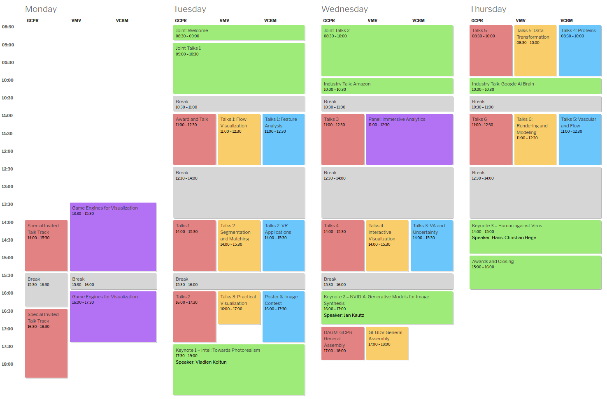
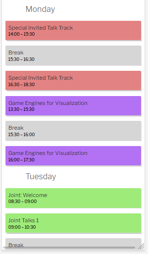

# ScheduleTool
A simple tool to create a Timetable based on a CSS Grid System. Mobile friendly, easy to extend and free.
The data is fetched from a Google Spreadsheet to allow multiple users and simple editing.
## Example
</img> -----  </img>
## Usage 
- Install the necessary requirements via pip:
    ```bash
    pip3 install --user -r requirements.txt
    ```
### Google Spreadsheet part
- Create a Google Docs API key so this application can access your documents. 
See [this URL](https://developers.google.com/sheets/api/quickstart/python) on how to create said API key.
- Save the file `credentials.json` from the previous step into `~/.config/gspread/credentials.json`. Under Windows systems, place the file under `%APPDATA%\gspread\credentials.json`.
    > Note: The `gspread` folder does not exist automatically once gspread is installed, you have to create it manually.
(Refer to the [gspread documentation](https://gspread.readthedocs.io/en/latest/) for further info.)
- Create a Google Spreadsheet with a sheet named `timetable`:
    - Take a look at the example excel file, you may copy to drive
- Fill in the first line:


| id                   | day            | start_time                           | end_time                           | class                             | track                               | title            | chair            | speaker            | hidden              | short              |
| -------------------- | -------------- | ------------------------------------ | ---------------------------------- | --------------------------------- | ----------------------------------- | ---------------- | ---------------- | ------------------ | ------------------- | ------------------ |
| Unique ID of session | Day of Session | Start time in 24h format without `:` | End time in 24h format without `:` | Special css class (eg. for color) | Track of session (eg. VCBM / joint) | Title of Session | Chair of Session | Speaker of Session | hidden (true/false) | short (true/false) |
- Share this spreadsheet
- More detailed information for the collumns can be found below
### Python part
- Edit following constants in the main.py
    -  `SPREADSHEET_URL = "https://docs.google.com/spreadsheets/d/XXXXXXXXXXXXXXX"` The url of the (shared) Spreadsheet
    - `SHOW_TRACK = False` Show/Hide Track information
    - `SHOW_CHAIR = True` Show/Hide Chair information
    - `SHOW_SPEAKER = True`Show/Hide Speaker information
    - `GRID_HOUR_START = 8` Start time of the grid (int)
    - `GRID_HOUR_END = 18` End time of the grid (int)
### CSS part
- Modify the `style.css`to match your needs

- Run the whole thing: `python3 main.py`
- It will create a `schedule.html`file.

## Explanation of the Google Spreadsheet
### ID
- String
- A uniqe id for the session. This id can be used as html anchor for a detailed preview. The whole session a a link reffering to this anchor.
### Day
- String
- Group every entry by day. The days will be created in order of appearance.
- Example: `Monday`,  `Tuesday`, `Last Day`

### start_time / end_time
- int
- Start/end time for the session
- 24 hour format without any special chars
- in 30 minutes steps
- Example: `0800`, `1230`, `1600`

### class
- String
- CSS class for this session
- See style.css for more information
- Example: `VCBM`, `joint`

### track
- String
- CSS grid-column: for this session
- See style.css for more information
- Example: `VCBM`, `joint`, `gcpr-start / vcbm-end`

### chair / speaker
- String
- Name of session-Chair / session-speaker
- See main.py to turn this globally on/off
- If this cell/collumn is empty, nothing will be shown

### hidden
- bool (actually a string: `true` , `false`)
- Determines if whole session is hidden.

### short
- bool (actually a string: `true` , `false`)
- Determines if its a short session. This will add another css class to it.
- Session will be displayed in one line.

## CSS
To view this timetable in a nice way the css file (style.css) must be included into the header.
just include the files content into a `<style> ... </style>` tag.

## Wordpress
Wordpress does some intressting stuff to the styling.
A (not so nice) way to include custom css is to click on the ` customize` button on the upper left side. This works only if you are an admin. Now there is a menue for additional css. Please make shure that you dont replace everything.

## Acknowledgements
- [gspread](https://github.com/burnash/gspread) is used for reading the Google spreadsheet.
- Mark Root-Wiley's idea to work with a CSS-Grid: https://css-tricks.com/building-a-conference-schedule-with-css-grid/
